.. ==================================================
.. FOR YOUR INFORMATION
.. --------------------------------------------------
.. -*- coding: utf-8 -*-

.. include:: ../../Includes.txt

.. _gui-mockups:

=============================================================
Gui mockups
=============================================================

((these screenshots have been collected - let's see if we can use them))

.. contents::
   :local:
   :depth: 1

   
background.png
--------------
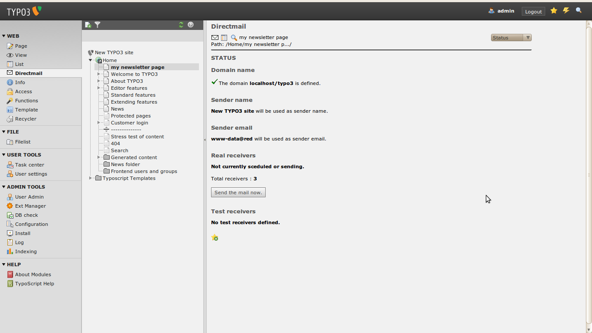

background_usertools.png
------------------------
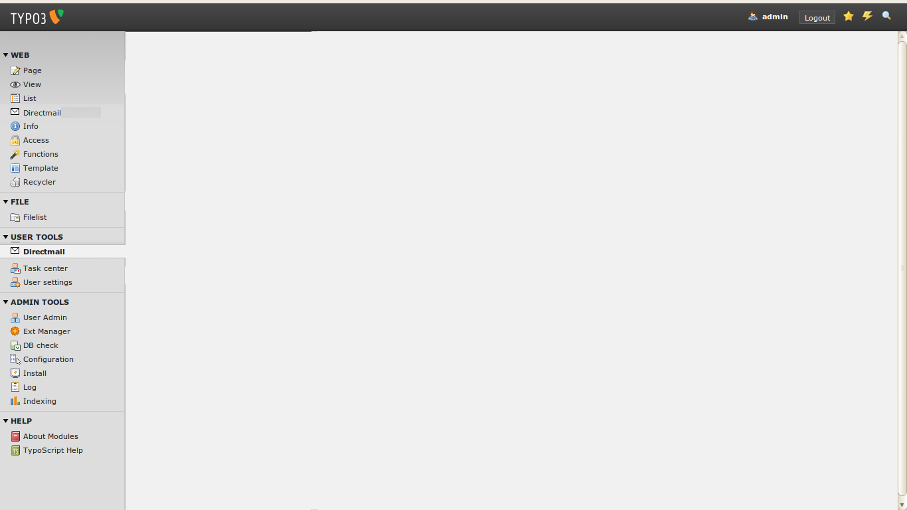

bullet_toggle_minus.png
-----------------------
.. image:: bullet_toggle_minus.png

bullet_toggle_plus.png
----------------------
.. image:: bullet_toggle_plus.png

calendar.png
------------
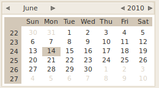

chart_bar.png
-------------
.. image:: chart_bar.png

chart_curve.png
---------------
.. image:: chart_curve.png

chart_pie.png
-------------

diagnostic-linkcheck.png
------------------------
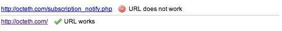

diagnostic.png
--------------
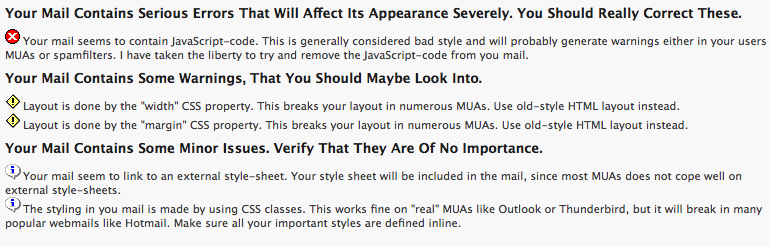

eye.png
-------
.. image:: eye.png

general-stats.png
-----------------
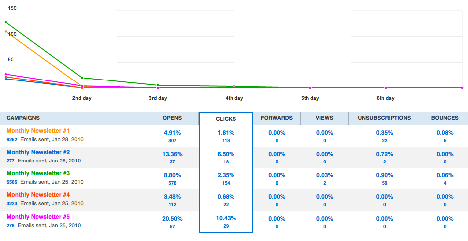

newsletter.svg
--------------
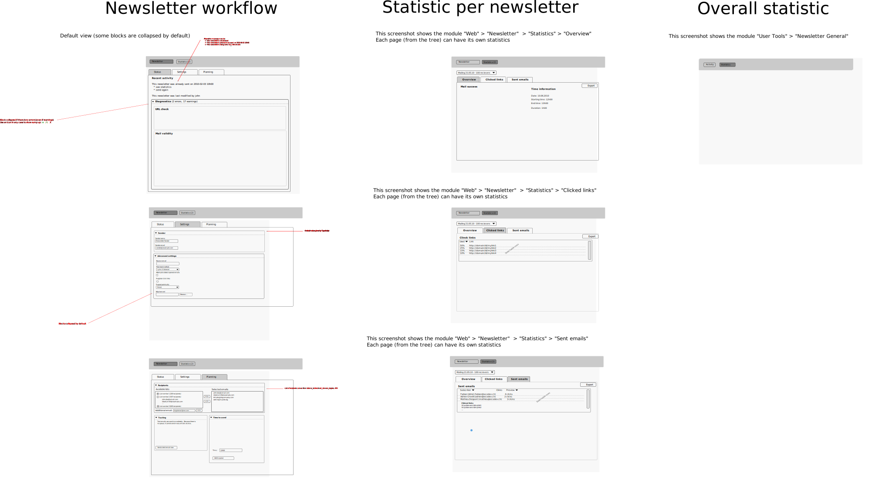

piechart.png
------------
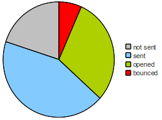

stats-click-graph.png
---------------------
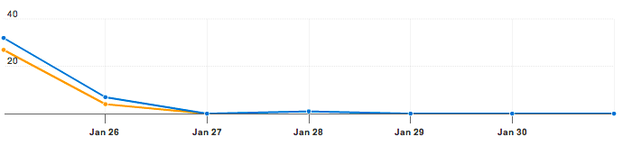

stats-general-graph-header.png
------------------------------
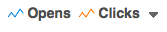

stats-general-graph.png
-----------------------
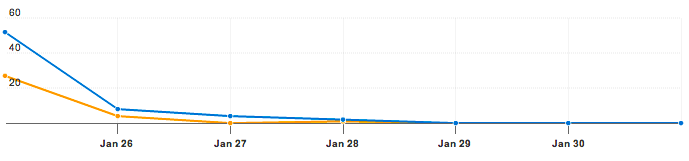

stats-general.png
-----------------
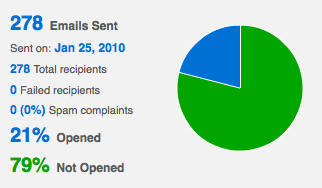
