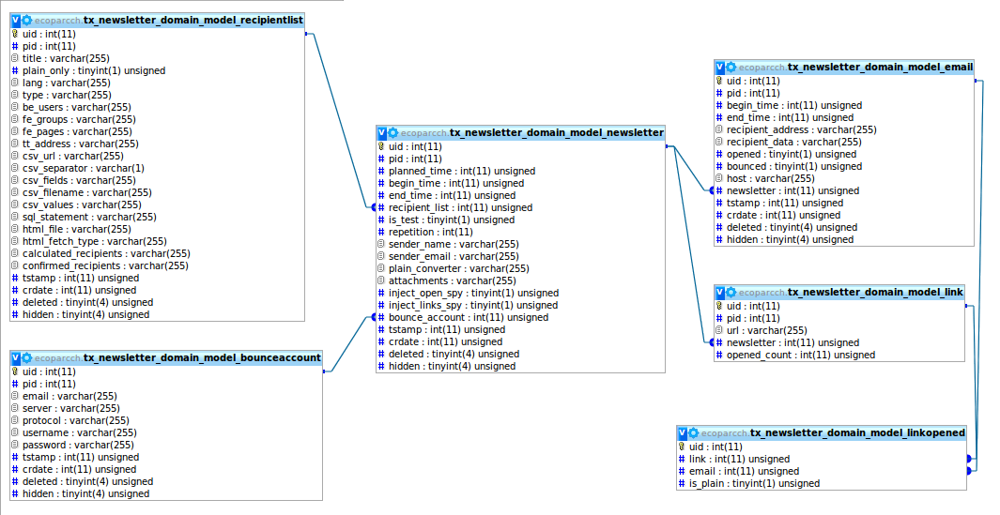

.. include:: ../Includes.txt

.. _admin-manual:

======================================
Administrators Manual
======================================

.. Describes how to manage the extension from an administrator’s point of
.. view. That relates to Page/User TSconfig, permissions, configuration
.. etc., which administrator level users have access to.
.. 
.. Language should be non/semi-technical, explaining, using small
.. examples.
.. 
.. Target group: **Administrators**
..
.. Possible subsection: FAQ
   
 
Installation
============
   
Install ``ext:newsletter`` in the backend using the normal procedure
in the extension manager. There is no static template to be included.

Requirement: ``ext:scheduler``

Basic extension configuration
=============================

#. Make sure the TYPO3 CMS extension ``ext:scheduler`` is setup properly.
   See :ref:`installing scheduler <t3scheduler:installing>`.
   
#. Schedule the task to send newsletters and - optionally - to fetch 
   bounce mails in the 
   :ref:`scheduler backend module <t3scheduler:backend-module>`.

#. Configure mail transport in ``LocalConfiguration.php``.
   See the :ref:`mailer class reference` in the API.
   http://api.typo3.org/typo3cms/current/html/class_t_y_p_o3_1_1_c_m_s_1_1_core_1_1_mail_1_1_mailer.html
   :ref:`t3cmsapi:TYPO3\\CMS\\Core\\Mail::Mailer`.
   :ref:`t3cmsapi:TYPO3\\CMS\\Core\\Mail`.

   .. code-block:: php
   
      <?php
          return array(
              'MAIL' => array(
                  'transport' => 'smtp',
                  'transport_smtp_server' => 'smtp.example.com:587',
              ),
          );
      ?>

Domain model
============

 
Migration from TC Directmail
============================

Migration from TC Directmail is possible via the Extension Manager. In
the menu “Update” of Newsletter extension a button is available to
migrate data. This feature is only available if TC Directmail is found
and Newsletter was never used.

Data migrated:

-  RecipientList
-  BounceAccount
-  Newsletter
-  Email sent
-  Bounce level for be_users and fe_users
-  TYPO3 CLI be_user (_cli_newsletter)

Data **not** migrated:

-  Links
-  Links clicked

.. toctree::
   :maxdepth: 5
   :titlesonly:
   :hidden:

   DifferencesWithTCDirectmail/Index
   GuiMockups/Index
   Doxyfile/Index
